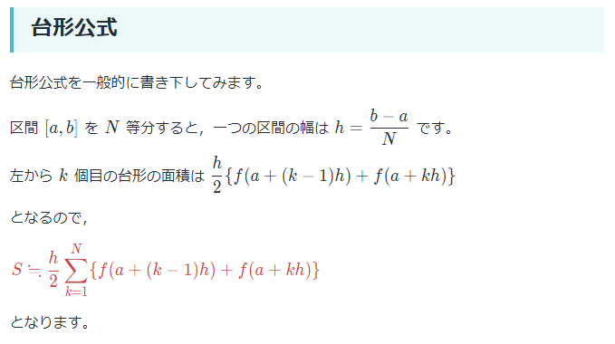
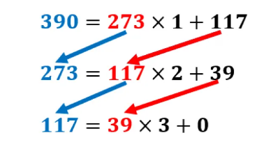

# Python 制御構文 確認課題

## 問1 素数判定
自然数 $n$ が与えられたとき、それが素数であるか、素数でないかを判定するコードを実装してください。  
問題に利用する自然数はタプルの形式で与えられます。
提出ファイル: `prime_number.py`  

(1) $61$が素数であることを確認して下さい  
(2) $10$が素数でないことを確認して下さい  

## 問2 台形積分
$sin$ 関数の$[0, \frac{1}{2}\pi]$における積分値を台形積分を用いて近似して下さい。区間の分割数は$100$とします。  
$sin$関数の値の計算には`math.sin`を利用します。冒頭で`import`されているので、皆さんは`sin(x)`のように使えばよいです。  
  
（台形積分の詳細は[こちら](https://manabitimes.jp/math/1088)）  
提出ファイル: `trapezoidal_integral.py`

## 問3 ユークリッドの互除法
各小問で与えられた自然数の組$(a, b)$の最大公約数を、ユークリッドの互除法を用いて求めて下さい。  
自然数の組$(a, b)$はタプルのタプルで与えられます。

ユークリッドの互除法とは、割り算の式
$$a = bq + r$$  
において  
「$a$と$b$の最大公約数」 = 「$b$と$r$の最大公約数」  
となる性質を利用してaとbの最大公約数を求める方法です。  
  
ユークリッドの互除法の詳細は[こちら](https://study-line.com/seisu-gojoho/)  
提出ファイル: `euclid.py`  
(1) $10, 20$  
(2) $14, 91$

### 補足
与えられた数字の大きさに依存しない実装にしてください。  

## 問4 マシンイプシロン
pythonにおいて $1 + eps > 1$ が成立するような$eps$の中で最小のものを求めてください。  
マシンイプシロンは$ eps ← \frac{eps}{2} $を繰り返して2進数の桁を1桁ずつ減らすことで求めることができます。
提出ファイル: `machine_epsilon.py`

### 補足
題の式を満たす最小の$eps$はマシンイプシロンと呼ばれています。  
